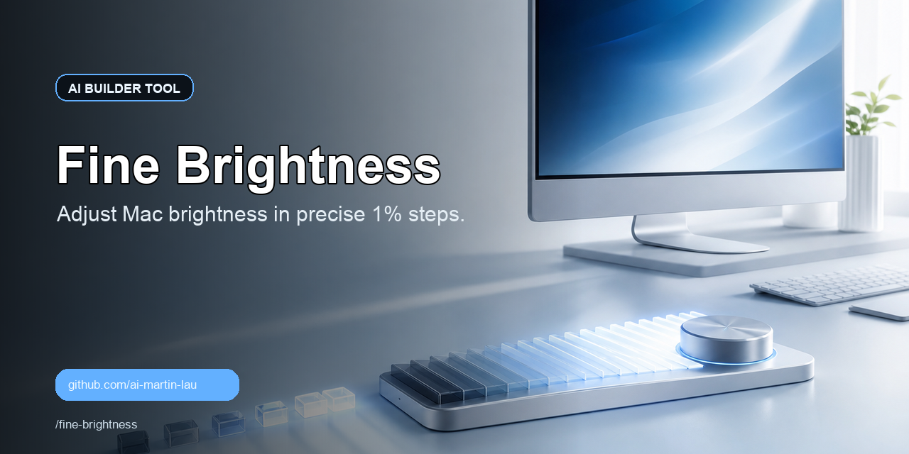

  <a href="README.md">English</a> · <a href="README_ZH.md">简体中文</a> · <a href="README_JA.md">日本語</a> · <a href="README_KO.md">한국어</a> · <a href="README_ES.md">Español</a>

  

# Fine Brightness

A macOS brightness fine-tuning tool that supports adjusting brightness in 1% increments.

## Download

Download the latest version: [`fine-brightness.dmg`](https://github.com/ai-martin-lau/fine-brightness/releases/latest/download/fine-brightness.dmg)

## Installation

1. Open the DMG.
2. Drag `Fine Brightness.app` into Applications.

The first time you open it, if macOS says it can't verify the developer, right-click the app and choose "Open".

## Star History

